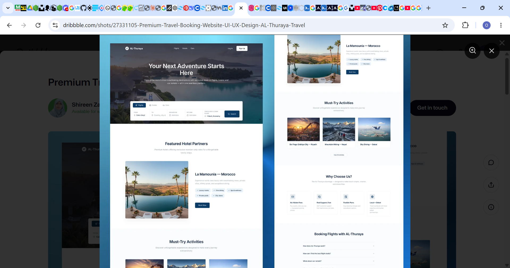
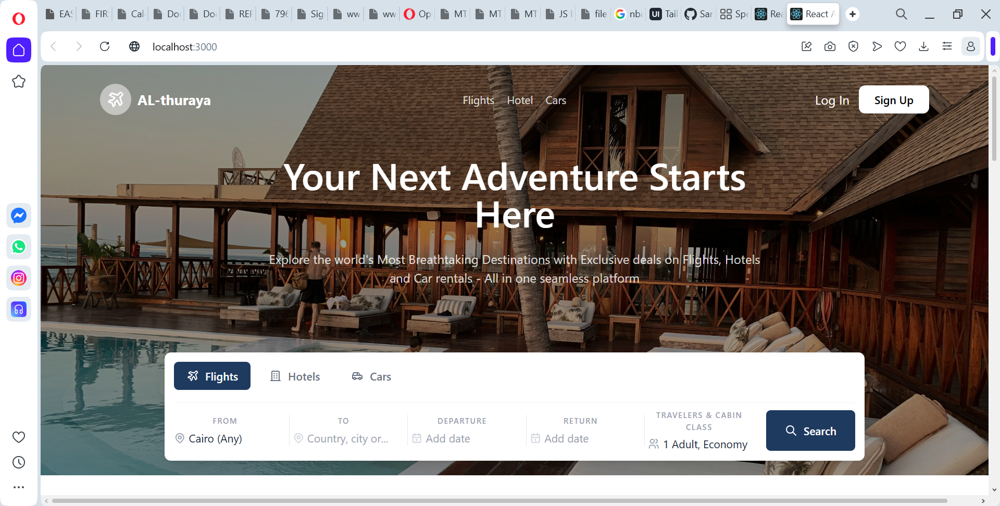

# 🏨 Luxury Hotel Page 2

A React-based landing page replica for a luxury hotel — a second iteration exploring a different design approach and layout compared to the original build. Recreates the elegant, high-end feel of a modern hotel booking site with a refined hero section, room showcases, and clean UI styled with Tailwind CSS.


## 🔍 Original vs. Replica

A side-by-side comparison of the original design and my recreation.

|                Original Design                |                   My Replica                   |
| :-------------------------------------------: | :--------------------------------------------: |
|  |  |

_Design inspired by [Original Hotel Site Name](#) — replicated for practice/learning purposes._

## 🧭 Project Status

This project is under active development. The desktop experience is fully built out; responsive support for tablet and mobile breakpoints is planned as the next milestone.

## ✨ Features

- Elegant hero section with call-to-action
- Room / suite showcase cards
- Amenities and services section
- Smooth navigation and clean component structure
- Styled with Tailwind CSS utility classes
- Built with modern React (Create React App)

## 🛠 Tech Stack

- **React** — UI library
- **JavaScript (ES6+)**
- **Tailwind CSS** — utility-first styling
- **Create React App** — project tooling and build setup

## 🚀 Live Demo

[View Live Site](https://luxuryhotel2.vercel.app/)

## 📦 Getting Started

### Prerequisites

Make sure you have [Node.js](https://nodejs.org/) and npm installed.

```bash
node -v
npm -v
```

### Installation

1. Clone the repository
   ```bash
   git clone https://github.com/SamuelIboi/luxury-Hotel-Page2.git
   ```
2. Navigate into the project folder
   ```bash
   cd luxury-Hotel-Page2
   ```
3. Install dependencies
   ```bash
   npm install
   ```
4. Start the development server
   ```bash
   npm start
   ```
5. Open [http://localhost:3000](http://localhost:3000) to view it in your browser.

## 📜 Available Scripts

| Command         | Description                                         |
| --------------- | --------------------------------------------------- |
| `npm start`     | Runs the app in development mode                    |
| `npm test`      | Launches the test runner in watch mode              |
| `npm run build` | Builds the app for production to the `build` folder |
| `npm run eject` | Ejects the CRA configuration (one-way operation)    |

## 📁 Project Structure

```
luxury-Hotel-Page2/
├── public/          # Static assets and index.html
├── src/             # React components, styles, and app logic
├── package.json     # Project metadata and dependencies
└── README.md
```

## 🤝 Contributing

Contributions, issues, and feature requests are welcome.

1. Fork the project
2. Create your feature branch (`git checkout -b feature/AmazingFeature`)
3. Commit your changes (`git commit -m 'Add some AmazingFeature'`)
4. Push to the branch (`git push origin feature/AmazingFeature`)
5. Open a Pull Request

## 📄 License

This project is open source and available under the [MIT License](LICENSE).

## 👤 Author

**Samuel Iboi**
GitHub: [@SamuelIboi](https://github.com/SamuelIboi)
Email: [kevwesamii@gmail.com](mailto:kevwesamii@gmail.com)

---

⭐️ If you like this project, consider giving it a star on GitHub!
